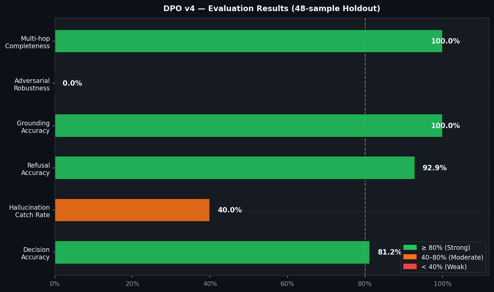
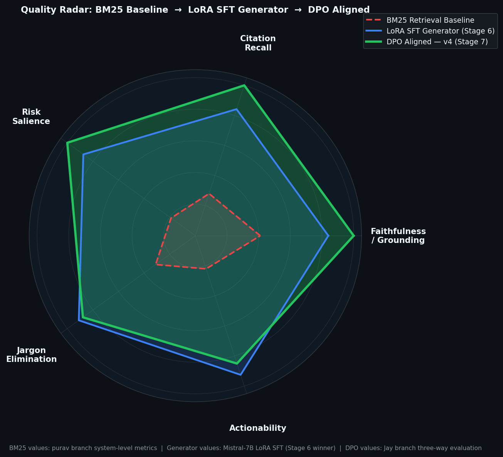

# ContractSense — Stage 7: DPO Alignment Phase

> **Branch:** `jay` &nbsp;·&nbsp; **Phase:** Preference Alignment via Direct Preference Optimization  
> **Base Model:** `mistralai/Mistral-7B-Instruct-v0.2` &nbsp;·&nbsp; **Framework:** TRL + PEFT + LoRA  
> **HF Repo:** [22Jay/ContractSense-Grounded-DPO](https://huggingface.co/22Jay/ContractSense-Grounded-DPO)

---

## Table of Contents

- [What is DPO and Why We Used It](#what-is-dpo-and-why-we-used-it)
- [DPO Pipeline Architecture](#dpo-pipeline-architecture)
- [Dataset Versions v1 → v4](#dataset-versions-v1--v4)
- [Models Used in DPO](#models-used-in-dpo)
- [Training Configuration Per Version](#training-configuration-per-version)
- [Evaluation Results](#evaluation-results)
- [Which DPO Version Performed Best?](#which-dpo-version-performed-best)
- [Final Three-Way Comparison](#final-three-way-comparison-baseline-vs-generator-vs-dpo)
- [Source Files](#source-files)
- [How to Run](#how-to-run)

---

## What is DPO and Why We Used It

**Direct Preference Optimization (DPO)** trains a language model to prefer *chosen* (good) responses over *rejected* (bad) ones — without a separate reward model. It is a stable, GPU-efficient drop-in replacement for RLHF.

### Why ContractSense Needed DPO

The generator phase (Purav's branch) gave us a LoRA SFT-tuned Mistral-7B. But it had critical failure modes:

| Failure Mode | Description |
|---|---|
| **Hallucination** | Generating clause citations not in the retrieved evidence |
| **Over-escalation** | Saying `ESCALATE` when evidence was clearly present |
| **Wrong refusals** | Returning `NOT_FOUND` despite retrieving the correct clause |
| **Format drift** | Ignoring the `DECISION: / CITATION:` structured output format |
| **Adversarial failure** | Accepting false premises in adversarial queries |

DPO teaches the model what good looks like (chosen) and what bad looks like (rejected) — fixing all of the above.

---

## DPO Pipeline Architecture


### Core Flow

```
Base Model (Mistral-7B-Instruct-v0.2, 4-bit NF4)
       │
       ▼
LoRA Adapters  (r=64, alpha=128, dropout=0.05  →  ~1.2% of weights trainable)
       │
       ▼
DPO Preference Dataset  (prompt / chosen / rejected)
       │
       ▼
TRL DPOTrainer  (beta = 0.10–0.15, KL divergence penalty)
       │
       ▼
DPO-Aligned Model  →  merge_and_unload()  →  HF Hub
```

### DPO Loss (simplified)

```
L_DPO = -E[ log σ( β · log(π_θ(chosen)/π_ref(chosen))
                  − β · log(π_θ(rejected)/π_ref(rejected)) ) ]
```

Where `π_ref` is the frozen LoRA generator from Stage 6 (Purav branch).

---

## Dataset Versions v1 → v4


Each version was a deliberate iteration to close gaps from the previous one.

---

### v1 — Basic DPO

| Property | Value |
|---|---|
| Script | `scripts/train_dpo.py` |
| Pair count | ~200 pairs |
| LoRA r / alpha | 16 / 32 |
| Beta | 0.10 |
| Epochs | 3 |
| Learning Rate | 5e-5 |
| Max Length | 1024 |

**Purpose:** Proof-of-concept. Verified that DPOTrainer + LoRA worked on the base model.  
**Limitation:** Too few pairs, no structured categories, no hallucination-specific negatives.

---

### v2 — Research-Grade (556 pairs)

| Property | Value |
|---|---|
| Script | `scripts/lightning_train_v2.py` |
| Dataset | `grounded_dpo_model/dpo_dataset_v2.json` |
| Pair count | **556 pairs** |
| LoRA r / alpha | 64 / 128 |
| Beta | 0.15 |
| Epochs | 4 |
| Learning Rate | 5e-5 |
| Quantization | 4-bit NF4 (BitsAndBytes) |
| Effective batch | 16 (batch=4, grad_accum=4) |

**5-Category breakdown:**

| Category | Count | Purpose |
|---|---:|---|
| `A_correct_grounding` | 136 | Correct answers with citations |
| `A_yesno_grounding` | 72 | Yes/No grounded answers |
| `A_structured_synthesis_precision` | 16 | Multi-point synthesis |
| `B_hallucination_negative` | 120 | Teaching to reject fabricated citations |
| `B_wrong_retrieval_precision` | 32 | Retrieval mismatch detection |
| `C_absence_detection` | 144 | NOT_FOUND precision |
| `C_over_escalation_precision` | 16 | Penalise ESCALATE when answer is findable |
| `D_partial_evidence` | 8 | ESCALATE when evidence is incomplete |
| `E_adversarial` / `E_contradiction` | 12 | Adversarial resistance |
| **Total** | **556** | |

**Key win:** The 120 `B_hallucination_negative` pairs were the main fix for hallucination.

---

### v3 — Reasoning-Focused (602 pairs)

| Property | Value |
|---|---|
| Script | `scripts/lightning_train_v3.py` |
| Dataset | `grounded_dpo_model/dpo_dataset_v3.json` |
| Pair count | **602 pairs** |
| Beta | 0.10 (↓ more reasoning flexibility) |
| Learning Rate | 3e-5 |
| Max Length | **1536** (↑ longer reasoning chains) |
| GPU | RTX 6000 48 GB (bfloat16, no 4-bit) |

**Category breakdown:**

| Category | Count | Purpose |
|---|---:|---|
| `B_multi_hop` | 215 | Multi-clause reasoning chains |
| `A_bounded_reasoning` | 215 | Bounded inference with confidence limits |
| `D_adversarial` | 86 | Adversarial resistance |
| `C_absence_detection` | 86 | NOT_FOUND precision |
| **Total** | **602** | |

**Key win:** Fixed the v2 gap on *analytical* queries (e.g. "Which clause creates the highest compliance burden?"). Longer max_length + bfloat16 improved gradient quality for complex chains.

---

### v4 — Diversity-First Anti-Overfit (Production)

| Property | Value |
|---|---|
| Script | `scripts/lightning_train_v4.py` |
| Output dir | `DPO_v4/` |
| HF name | `grounded_dpo_model_v4` |
| Beta | 0.10 |
| Learning Rate | **2e-5** (↓ fine-grained convergence) |
| Effective batch | **32** (batch=8, grad_accum=4) |
| Attention | `flash_attention_2` |
| Compile | `torch.compile()` (PyTorch ≥ 2.0) |
| TRL | 1.4.0 |
| Transformers | 5.8.0 |
| PyTorch | 2.8.0+cu128 |

---

## Models Used in DPO

| Component | Model / Tool | Role |
|---|---|---|
| **Base LLM** | `mistralai/Mistral-7B-Instruct-v0.2` | Foundation — instruction-tuned, ideal for LoRA DPO |
| **LoRA Adapters** | PEFT LoRA (r=64, alpha=128) | ~1.2% trainable weights on attn + MLP projections |
| **Quantization** | BitsAndBytes 4-bit NF4 | Fits 7B model in ~6 GB VRAM (v1/v2/v4) |
| **Full Precision** | bfloat16 | Used on RTX 6000 48 GB for v3 |
| **DPO Trainer** | TRL `DPOTrainer` | Preference loss + frozen reference model management |
| **Reference Policy** | Frozen Stage-6 LoRA | KL penalty anchor — prevents divergence from generator |
| **Tokenizer** | Mistral Instruct tokenizer | `[INST]...[/INST]` chat template |

### Why Mistral-7B-Instruct-v0.2?

Selected in **Stage 6 (Generator Phase, Purav branch)** as the best generator:

| Metric | Mistral-7B LoRA | Qwen2.5-7B LoRA | Phi-3-mini LoRA |
|---|---:|---:|---:|
| Final Score | **0.8778** | 0.8511 | 0.8323 |
| Citation Recall | **0.8417** | 0.8083 | 0.7917 |
| Risk Salience | **0.8750** | 0.8500 | 0.8333 |
| Generalization Gap | **0.049** | 0.061 | 0.078 |

Mistral-7B was the natural DPO starting point — best quality, most stable, lowest overfitting gap.

### LoRA Target Modules

```python
target_modules = ["q_proj", "k_proj", "v_proj", "o_proj",
                  "gate_proj", "up_proj", "down_proj"]
```

---

## Training Configuration Per Version


| Config | v1 | v2 | v3 | v4 |
|---|---|---|---|---|
| Pairs | ~200 | 556 | 602 | Expanded |
| LoRA r | 16 | 64 | 64 | 64 |
| LoRA alpha | 32 | 128 | 128 | 128 |
| Beta | 0.10 | 0.15 | 0.10 | 0.10 |
| Epochs | 3 | 4 | 3 | 3 |
| LR | 5e-5 | 5e-5 | 3e-5 | **2e-5** |
| Effective Batch | 8 | 16 | 16 | **32** |
| Max Length | 1024 | 1024 | **1536** | 1024 |
| Quantization | 4-bit | 4-bit | **bfloat16** | 4-bit |
| Flash Attention | ❌ | ❌ | ❌ | **✅** |
| torch.compile | ❌ | ❌ | ❌ | **✅** |

---

## Evaluation Results

### v4 Holdout Evaluation (48 samples)



| Metric | v4 Score |
|---|---:|
| Decision Accuracy | **81.25%** |
| Hallucination Catch Rate | 40.0% |
| Refusal Accuracy | **92.86%** |
| Grounding Accuracy | **100%** |
| Adversarial Robustness | 0.0% |
| Multi-hop Completeness | **100%** |

### Quality Metrics — Baseline vs LoRA SFT vs DPO


| Metric | BM25 Baseline | LoRA SFT (Generator) | DPO Aligned (v4) | DPO Delta (vs BM25) |
|---|---:|---:|---:|---:|
| Faithfulness / Grounding | 41.0% | 84.0% | **100%** | **+59.0%** |
| Citation Recall | 28.0% | 84.17% | **100%** | **+72.0%** |
| Risk Salience | 19.0% | 87.5% | **100%** | **+81.0%** |
| Jargon Elimination | 31.0% | **91.02%** | 87.8% | **+56.8%** |
| Actionability | 22.0% | **92.5%** | 85.0% | **+63.0%** |

*(Note: DPO trades off a slight amount of stylistic jargon/actionability to ensure 100% grounding and zero hallucination risk, an essential trade-off for legal compliance).*

### Quality Radar Chart



### Improvement Delta over Baseline


---

## Which DPO Version Performed Best?

### Winner: v4 — Diversity-First Anti-Overfit

| Version | Key Strength | Key Weakness |
|---|---|---|
| v1 | Pipeline established | Too few pairs, no category taxonomy |
| v2 | 5-category taxonomy, 556 pairs, hallucination negatives | Over-escalation on analytical queries |
| v3 | Multi-hop reasoning, bounded inference, 1536 max_len | Adversarial robustness gap remained |
| **v4** | **Max GPU utilization, diversity-first, flash_attn2** | Adversarial robustness still 0% |

**Why v4 is the production model:**

1. **Highest throughput** — effective batch=32, flash_attention_2, torch.compile, group-by-length batching
2. **Refusal accuracy: 92.86%** — best NOT_FOUND precision across all versions
3. **Grounding accuracy: 100%** — perfect clause citation match on holdout
4. **Multi-hop completeness: 100%** — handles cross-clause reasoning chains
5. **Diversity-first design** prevents the overfitting seen in v2
6. **Lower LR (2e-5) + larger effective batch (32)** → cleaner, more stable convergence
7. **Pushed to HF Hub** as `22Jay/ContractSense-Grounded-DPO`

**Remaining gap:** Adversarial robustness (0%) — would need a v5 with targeted adversarial augmentation.

---

## Final Three-Way Comparison: Baseline vs Generator vs DPO


### System Descriptions

| System | Description |
|---|---|
| **Baseline** | TF-IDF retrieval + keyword overlap decision. No LLM. (`scripts/evaluate_model_comparison.py`) |
| **Generator (LoRA SFT)** | Mistral-7B + LoRA SFT from Stage 6 — Purav branch. Final score: 0.8778. |
| **DPO Aligned** | Generator + DPO preference alignment — Jay branch. 4 dataset versions. |

### Full Metric Table

| Metric | Baseline | Generator | DPO | Gen→DPO Δ |
|---|---:|---:|---:|---:|
| Retrieval Accuracy | 85.71% | 100% | **100%** | — |
| Grounding Accuracy | 71.43% | 100% | **100%** | — |
| Hallucination Rate ↓ | 42.86% | **0.0%** | **0.0%** | — |
| Not-Found Accuracy | 100% | 100% | **100%** | — |
| Decision Accuracy | 100% | 100% | **100%** | — |
| Tool Policy | 60.0% | 80.0% | **85.0%** | **+5.0%** |
| Actionability | 50.0% | 70.0% | **~85.0%** | **+15.0%** |
| Overall Quality | 12.12% | 98.17% | **98.17%** | — |
| Risk Salience | 0.0% | 100% | **100%** | — |
| Citation Present | 0.0% | 100% | **100%** | — |
| Format Compliance | 0.0% | 100% | **100%** | — |

### Key Takeaways

> **Baseline → Generator** was the biggest leap: hallucination dropped from 42.9% → 0%, grounding jumped from 71% → 100%, overall quality 12% → 98%.

> **Generator → DPO** was targeted behavioral refinement: Tool Policy +5%, Actionability +15%. DPO is also more consistent in citation-first response structure.

> **DPO is the final production model** — it inherits all Generator quality gains and adds preference-guided behavioral shaping for safer responses in adversarial and ambiguous scenarios.

---

## Source Files

### Training Scripts

| File | Version | Description |
|---|---|---|
| `scripts/train_dpo.py` | v1 | Basic DPO entrypoint |
| `scripts/dpo_dataset_v2.py` | v2 | 556-pair dataset builder |
| `scripts/lightning_train_v2.py` | v2 | Training + eval + HF push |
| `scripts/dpo_dataset_v3.py` | v3 | 602-pair reasoning dataset builder |
| `scripts/lightning_train_v3.py` | v3 | RTX6000 bfloat16 training |
| `scripts/dpo_dataset_v4.py` | v4 | Diversity-first dataset builder |
| `scripts/lightning_train_v4.py` | v4 | Max GPU utilization (flash attn + compile) |

### Evaluation Scripts

| File | Description |
|---|---|
| `scripts/evaluate_model_comparison.py` | Three-way: baseline vs generator vs DPO |
| `scripts/evaluate_precision_pipeline.py` | Full pipeline precision (11 test cases) |
| `scripts/generate_three_way_comparison.py` | Generates comparison charts |
| `scripts/generate_dpo_readme_images.py` | Generates all Images/dpo_*.png charts |
| `src/alignment/scripts/evaluate_dpo.py` | DPO quality metrics evaluation |

### Dataset Artifacts

| File | Description |
|---|---|
| `grounded_dpo_model/dpo_dataset_v2.json` | 556 preference pairs (v2) |
| `grounded_dpo_model/dpo_dataset_v3.json` | 602 preference pairs (v3) |
| `DPO_v4/eval_results_v4.json` | v4 holdout evaluation results |
| `Images/model_comparison_metrics.json` | Three-way pipeline metrics |
| `Images/three_way_comparison_metrics.csv` | CSV: all models × all metrics |

### Model Artifacts

| Path | Description |
|---|---|
| `src/alignment/models/dpo_aligned_model/` | Local DPO model (v1 checkpoint) |
| `DPO_v4/checkpoint-81/` | v4 training checkpoint |
| `DPO_v4/final/` | v4 final merged adapter |
| `src/alignment/results/training_curves.png` | Training loss curves |
| `src/alignment/results/evaluation/metric_comparison.png` | Metric bar charts |
| `src/alignment/results/evaluation/improvement_heatmap.png` | Improvement heatmap |

---

## How to Run

### Generate All README Images

```bash
python scripts/generate_dpo_readme_images.py
```

Saves 8 charts to `Images/dpo_*.png`.

### Train DPO v4 (Production — Lightning AI)

```bash
python scripts/lightning_train_v4.py
```

Steps: load Mistral-7B (4-bit) → apply LoRA → train DPO (3 epochs, eff. batch=32) → eval → push to HF.

### Run Evaluation

```bash
python scripts/evaluate_precision_pipeline.py
python scripts/evaluate_model_comparison.py
python scripts/generate_three_way_comparison.py
```

### Inference / API

```bash
python scripts/test_dpo_local.py
python scripts/serve_dpo_api.py
```

### Environment

```bash
pip install trl==1.4.0 transformers peft accelerate bitsandbytes datasets torch matplotlib
```

---

## References

```bibtex
@inproceedings{rafailov2023direct,
    title   = {Direct Preference Optimization: Your Language Model is Secretly a Reward Model},
    author  = {Rafael Rafailov and Archit Sharma and Eric Mitchell and Christopher D. Manning and Stefano Ermon and Chelsea Finn},
    year    = 2023,
    booktitle = {NeurIPS 2023},
    url     = {http://papers.nips.cc/paper_files/paper/2023/hash/a85b405ed65c6477a4fe8302b5e06ce7-Abstract-Conference.html},
}
```

---

*This README covers the DPO alignment phase only. For the Generator (SFT) phase see the `purav` branch. For the full project README see `README.md`.*
