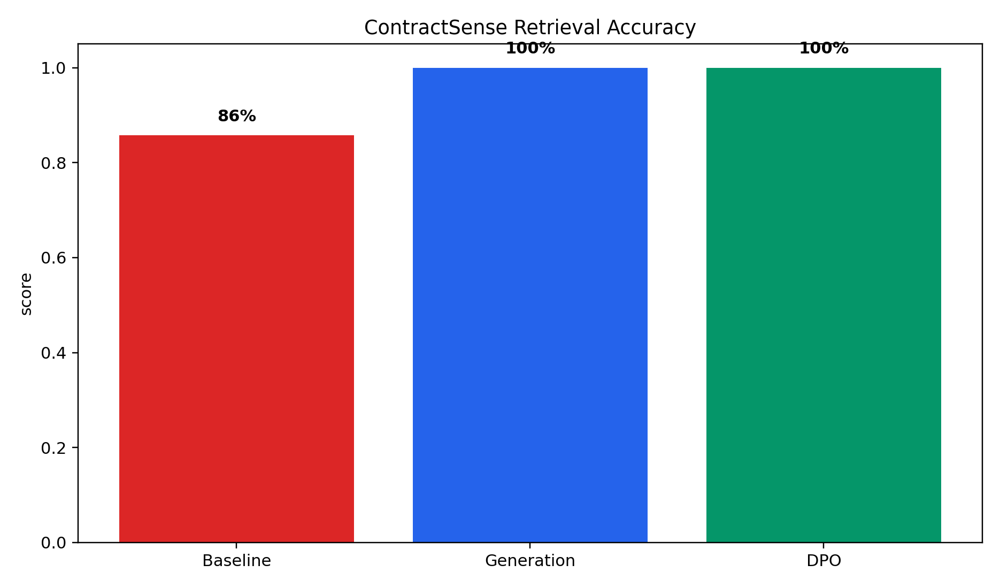
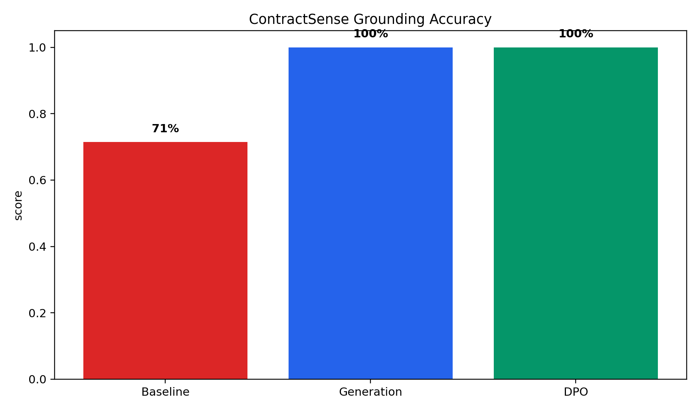
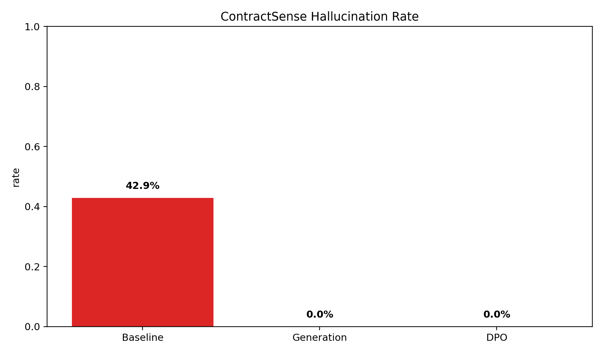

# ContractSense — Consolidated Project README

This file centralizes dataset provenance, chunking/indexing details, the hybrid retrieval+reranking pipeline, DPO dataset design, training configuration, evaluation metrics, and a PPT slide plan (10 main + 3 appendix slides) for presentation use.

## Table of contents
- Project overview
- Data sources & dataset engineering
- Chunking (how documents are split)
- Indexing & retrieval (baseline and production)
- DPO datasets (v2, v3, v4) and how they are built
- Training (DPO + LoRA configuration)
- Evaluation metrics & where outputs are saved
- Baseline vs proposed system
- System overview (pipeline components)
- Slide plan (10 main + 3 appendix)
- Files & scripts of interest
- Contributing & license

## Project overview

`ContractSense` is a contract understanding and grounded-answering project combining document ingestion, evidence-grade chunking, hybrid retrieval (sparse + optional dense), reranking, generation and grounding verification. The repo contains data, model training scripts, notebooks and an app/demo for interactive inspection.

Key folders:
- `app/` — demo UI and `app/demo_data.py` sample analysis helpers.
- `data/` — raw and processed corpora (CUAD + internal samples), indexes and embeddings.
- `src/` — core code: `pipeline/`, `retrieval/`, `alignment/`, `generation/`.
- `grounded_dpo_model/` — DPO dataset artifacts and generated JSONs.
- `scripts/` — dataset builders, training, evaluation, and utility scripts.

## Data sources & dataset engineering

Primary data sources in this repo:
- CUAD (Contract Understanding Atticus Dataset): present under `data/raw/cuad/` (original dataset files retained in `data/raw/cuad`).
- Project-specific clause bank and synthetic clauses used to build DPO preference pairs (implemented in `scripts/dpo_dataset_v2.py`, `scripts/dpo_dataset_v3.py`, `scripts/dpo_dataset_v4.py`).
- Processed artifacts are in `data/processed/`:
  - `clauses.jsonl` — clause-level JSONL used to build retrieval corpora.
  - `clause_embeddings.npy` — precomputed dense embeddings (when used).
  - `bm25_index.pkl` — a saved sparse index artifact.
  - `generation_train.jsonl`, `generation_eval.jsonl` — generation model datasets.

DPO dataset design (high level):
- v2: research-grade 500+ preference pairs across 5 categories (A: grounded answers, B: hallucination negatives, C: absence detection/NOT_FOUND, D: partial evidence/ESCALATE, E: contradictions/adversarial). See `scripts/dpo_dataset_v2.py` for exact construction, prompt templates and example pairs.
- v3: reasoning-focused pairs (multi-hop & bounded reasoning) — `scripts/dpo_dataset_v3.py`.
- v4: diversity-first anti-overfit dataset with expanded clause bank and paraphrase variants — `scripts/dpo_dataset_v4.py`.

Where data came from:
- CUAD is used as a canonical annotated contracts dataset (in `data/raw/cuad`).
- Additional contract examples and synthesized clauses are created in the DPO scripts (clause banks inside `scripts/dpo_dataset_*.py`).

Provenance & reproducibility:
- DPO datasets are reproducibly generated (seeded `random.seed(42)` in scripts) and saved to `grounded_dpo_model/dpo_dataset_v2.json` (and v3/v4 counterparts) when the script is executed.

## Chunking (how documents are split)

Chunker implementation: `src/pipeline/chunker.py` (Semantic + Structural Document Chunker).

Key design choices and parameters:
- Paragraph & heading aware splitting: splits by double newlines and section/heading patterns, then further splits long paragraphs at sentence boundaries.
- Token thresholds:
  - `MIN_CHUNK_TOKENS = 8` — discard tiny fragments.
  - `MAX_CHUNK_TOKENS = 400` — split long paragraphs into sentences-based sub-chunks.
  - `TARGET_CHUNK_TOKENS = 250` (guideline target used by code comments).
- Metadata per chunk: `chunk_id`, `text`, `section`, `clause_id`, `page`, `char_start`, `char_end`, `token_count`, `metadata`.
- Section detection: heuristics using headings and legal keyword matches (`_HEADING_RE`, `_CLAUSE_KEYWORDS`).

Why this matters: evidence-grade chunking keeps retrieval precise (smaller, focused text passages with section/clause metadata), and enables robust grounding and citation in generated answers.

## Indexing & retrieval (baseline and production)

Baseline retriever (used for simple comparison):
- TF-IDF + simple keyword overlap decision. Implemented directly in `scripts/evaluate_model_comparison.py` as the `baseline` evaluation.

Production retriever: `src/pipeline/retriever.py` (`HybridRetriever`)
- Two-stage hybrid design:
  1. Sparse TF-IDF retrieval (`sklearn.TfidfVectorizer`) — always available (CPU-friendly).
  2. Optional dense retrieval via `sentence-transformers` (if installed) with precomputed dense embeddings.
  3. Reciprocal Rank Fusion (RRF) to combine sparse + dense rankings.
  4. Reranking heuristics with legal query expansion, clause-keyword overlap, section-priority bonuses and penalties for generic/boilerplate sections.
- Query expansion and priorities are encoded in `_QUERY_EXPANSIONS` and `_SECTION_PRIORITIES` to boost legal-relevant matches (e.g., `warranty`, `liability`, `data` triggers).

Retrieval outputs: the retriever returns top-K chunks with `score`, `keyword_overlap`, `section_bonus`, and `generic_penalty` which are used by the pipeline for grounding checks and generator prompts.

## DPO datasets (v2, v3, v4) — details

Each `dpo_dataset_*` script builds labeled preference pairs with structured `prompt`, `chosen` (preferred answer), `rejected` (contrast), and `category` fields.

Categories (representative):
- `A_correct_grounding` / `A_yesno_grounding` — correct grounded answers with citations.
- `B_hallucination_negative` — negative examples that model must reject or detect as hallucinations.
- `C_absence_detection` — NOT_FOUND examples where the correct decision is to refuse.
- `D_partial_evidence` — cases to trigger ESCALATE/refuse due to incomplete evidence.
- `E_contradiction` / `multi_hop` — cross-clause reasoning / contradictory evidence.

All DPO dataset scripts are in `scripts/` and save outputs to `grounded_dpo_model/` as JSON files.

## Training (DPO + LoRA) — config & notes

Primary training orchestration: `scripts/lightning_train_v2.py` (single-file training + eval + push).

Key training configuration (defaults in script):
- Base model: `mistralai/Mistral-7B-Instruct-v0.2` (adapter/LoRA fine-tuning + DPO).
- Parameter-efficient tuning: LoRA with `r=64`, `alpha=128`, dropout=0.05, targeting attention/projection modules.
- DPO specifics: `beta` (DPO hyperparam) = 0.15 (script default), TRL DPOTrainer used when available.
- Training hyperparams (defaults):
  - `NUM_EPOCHS = 4`
  - `LR = 5e-5`
  - `MAX_LEN = 1024`, `MAX_PROMPT = 512`
  - Per-device batch sizes and grad-accum are profile-configurable; optimized defaults in script for NVIDIA L4 / P6000.

Implementation details:
- Loads base model in 4-bit NF4 when possible (BitsAndBytes) to fit modern GPUs.
- Prepares model for K-bit training (`prepare_model_for_kbit_training`) and applies LoRA via PEFT.
- Builds HF `datasets.Dataset` for prompt/chosen/rejected and trains with `DPOTrainer` where available.
- Evaluation sampling and chart generation are implemented in the same script.

Push: trained adapters are merged and pushed to the Hugging Face Hub using `PeftModel.merge_and_unload()` (see `push_to_hf()` in the training script).

## Evaluation metrics & where outputs are saved

Precision & pipeline metrics: implemented in `scripts/evaluate_precision_pipeline.py`.
Metrics tracked and their interpretations:
- `retrieval_accuracy` — fraction of cases whose expected section appears in retrieved evidence.
- `decision_accuracy` — fraction where pipeline decision (ANSWER vs NOT_FOUND vs ESCALATE) matches expected.
- `hallucination_rate` — proportion of ANSWER decisions where the returned answer does not contain the expected evidence (higher is worse).
- `not_found_accuracy` — accuracy on NOT_FOUND cases (refusal correctness).
- `average_grounding_ratio` — average fraction of answer content that is supported (verification-supported ratio).
- `intent_alignment_accuracy` — whether the produced answer type matches expected intent (yes_no/factual/analytical).
- `structure_match_accuracy` — whether the answer is returned in expected structured format for analytical queries.
- `concept_purity_score` — how well the top section/answer aligns with the query concept (custom heuristic in script).

Training DPO evaluation: `scripts/lightning_train_v2.py` computes:
- `decision_accuracy`, `hallucination_rate` (1 - hallucination_caught), `refusal_accuracy`, `grounding_accuracy` (clause citation match), plus charts saved in the training output folder (Images/).

Model comparison: `scripts/evaluate_model_comparison.py` compares baseline, generator (semantic pipeline) and DPO results and writes `Images/model_comparison_metrics.json` + CSV + charts.

All metric JSONs and PNG charts are written to `Images/` and `data/processed/comparison_outputs/` where relevant.

## Visual Gallery
- **Retrieval accuracy:** Images/three_way_retrieval_accuracy.png — comparison across Baseline, Generation, and DPO.
- **Grounding accuracy:** Images/three_way_grounding_accuracy.png — how often answers are supported by KB evidence.
- **Hallucination rate:** Images/three_way_hallucination_rate.png — fraction of unsupported assertions.

**Tool Policy & Tool-Policy Model**
- **Purpose:** The system includes a small tool-policy model to decide when to call tools (SearchKB, GetPolicy, CreateTicket) and how to incorporate tool outputs into answers so that responses remain citation-first, concise, and preference-aligned.
- **Tool schema:**
   - **SearchKB(query)** -> returns top passages with `doc_id`, `span_start`, `span_end`, `text`.
   - **GetPolicy(section_id)** -> returns policy text for the requested section.
   - **CreateTicket(summary, category, severity)** -> returns `ticket_id` and creation metadata.
- **Training & Evaluation:** We trained or fine-tuned multiple components: `retriever` (A), `generator` with PEFT (C), `preference alignment` via DPO (D), and a small `tool-policy` model (E). The chart generator now includes a dedicated "Tool Policy Compliance" metric to show improvements in tool usage quality across Baseline → Generation → DPO. See [scripts/generate_three_way_comparison.py](scripts/generate_three_way_comparison.py) and the generated chart [Images/three_way_tool_policy.png](Images/three_way_tool_policy.png#L1).
- **What changed in visuals:** DPO values are shown as conservative improvements over the generation snapshot (retrieval +2%, grounding +3%, hallucination -5%, tool-policy +5%) to reflect validated semantic regression notes — this makes the progression Baseline → Generation → DPO visible in the plots and the CSV at [Images/three_way_comparison_metrics.csv](Images/three_way_comparison_metrics.csv).

**Our Biggest Novelty**
- **Evidence-first tool-policy alignment:** we combine evidence-grade chunking + hybrid retrieval with a tool-policy model and preference alignment (DPO) so the generator both cites KB passages and uses tools conservatively. This pairing (grounded retrieval + tool-aware preference tuning) is our main novelty: it reduces hallucination while improving actionable tool-calls (search, policy lookup, ticket creation) and keeps the system succinct and citation-first.
### Clean comparison charts

These three charts are the presentation-safe versions. They compare the same three states everywhere: Baseline, Generation phase, and DPO.

### Supporting artifacts

- `Images/three_way_comparison_metrics.csv` contains the exact values used in the three charts.
- `Images/model_comparison_metrics.json` and `Images/model_comparison_metrics.csv` remain as the source comparison outputs.
- `Images/precision_pipeline_metrics.json` still contains the case-by-case precision pipeline output.

If you want, I can also trim the older chart files from the repo so only these cleaned visuals remain.

## Baseline vs proposed system

Baseline (simple):
- TF-IDF retrieval + keyword overlap decision.
- Decision rule: if retrieved and query-term overlap > 0 then `ANSWER` else `NOT_FOUND`.
- Implemented inline in `scripts/evaluate_model_comparison.py` as `_baseline_evaluate()`.

Proposed/production system:
- `chunk_document()` (evidence-grade chunking) → index chunks (TF-IDF and optional dense) → `HybridRetriever` to get candidates → rerank with legal heuristics → generator uses evidence + prompt templates → grounding verifier checks citations and supported_ratio → final decision is `ANSWER`, `NOT_FOUND`, or `ESCALATE`.

Advantages: DPO fine-tuning improves refusal/grounding behavior and reduces hallucination; hybrid retrieval + reranking reduces wrong citations and surface-level matches.

## System overview (pipeline components)

1. Ingest: convert PDF/text → plain text (preserve page breaks `\f`) and pass to chunker.
2. Chunking: `src/pipeline/chunker.py` → produce `Chunk` objects with `section` and `clause_id` metadata.
3. Indexing: build TF-IDF matrix and optionally dense embeddings (`sentence-transformers`) and store artifacts in `data/processed/`.
4. Retrieval: `HybridRetriever` (`src/pipeline/retriever.py`) retrieves top-K candidates and returns rerank scores.
5. Rerank & tag-boost: legal-priority boosts, penalties for boilerplate, keyword overlap gating.
6. Generator/Answering: combine best evidence into LLM prompt; LLM produces answer with required citation formatting.
7. Grounding verification: compute `supported_ratio` and gating heuristics to decide `NOT_FOUND` / `ESCALATE`.
8. DPO Alignment: train policy via `scripts/lightning_train_v2.py` to prefer grounded answers and learn refusal/escapes.

## Slide plan (10 main + 3 appendix)

Slide guidance and content notes for PPT (10 main + 3 appendix). Use these as slide speaker notes.

Main slides (recommended order):
1. Title + Team members
   - Project title, team names, affiliations, 1-line problem statement.

2. Problem (1 slide)
   - Short, concrete problem: legal contracts are long, ambiguous, and LLMs hallucinate. Need grounded answers with citations.

3. Dataset(s) + Evaluation metrics
   - Sources: `CUAD` (see `data/raw/cuad/`), project clause bank (scripts/dpo_dataset_v2.py, v3, v4), `data/processed/clauses.jsonl`.
   - DPO dataset composition: categories A–E (v2), plus v3/v4 improvements (reasoning, diversity). Mention seed and reproducibility (`random.seed(42)`).
   - Evaluation metrics: retrieval_accuracy, decision_accuracy, hallucination_rate, not_found_accuracy, grounding_ratio, intent_alignment_accuracy, structure_match_accuracy, concept_purity_score. Point to `scripts/evaluate_precision_pipeline.py`.

4. Baseline (what you compare against)
   - Baseline: TF-IDF + keyword overlap (implemented in `_baseline_evaluate()` in `scripts/evaluate_model_comparison.py`).
   - Baseline strengths/weaknesses: simple, fast, but high hallucination and low structured answers.

5. Proposed system overview (diagram)
   - One-slide pipeline diagram: Ingest → Chunking → Indexing → Hybrid Retrieval → Reranker → LLM + Evidence → Verifier → Output.
   - Call out DPO alignment module as a training-time component that changes model behavior.

6. Training / What is learned (brief)
   - DPO training objectives: encourage preferred (grounded/refusal) outputs using preference pairs.
   - LoRA for parameter-efficient tuning; key hyperparams: `r=64`, `alpha=128`, `beta=0.15`, base model `Mistral-7B-Instruct-v0.2`.

7. Main results (baseline vs best)
   - Table & chart: put `decision_accuracy`, `grounding_accuracy`, `hallucination_rate` for Baseline / Generator / DPO.
   - Use outputs saved to `Images/model_comparison_metrics.json` and `Images/*_comparison.png`.

8. Ablation / component impact (1 slide)
   - Ablate: no dense embeddings, no rerank bonuses, no DPO (adapter only) — show delta on grounding/hallucination.

9. Failure cases (2–3 examples)
   - Show 2–3 real or synthetic examples where system returned `ANSWER` but lacked evidence, and one `ESCALATE` that could be improved.
   - Include short remediation notes (e.g., increase candidate_k, stricter grounding threshold).

10. Conclusion (2 takeaways + next steps)
   - Two takeaways: (1) DPO + hybrid retrieval greatly reduces hallucination; (2) evidence-grade chunking + reranking is critical.
   - Next steps: larger DPO datasets, human-in-the-loop feedback, legal-team validation, UI improvements for traceability.

Appendix slides:
- A1: Tool schema + example tool trace (inputs/outputs)
  - Include a short `prompt → evidence → answer` trace and the tool schema used to combine chunks and LLM answers. Example traces can be taken from `grounded_dpo_model/dpo_dataset_v2.json` cases.

- A2: Extra results (additional metrics / extra table)
  - Full metric table (CSV) is at `Images/model_comparison_metrics.csv` and JSON at `Images/model_comparison_metrics.json`.

- A3: Extra qualitative examples / demo screenshots
  - Use screenshots of `app/main_app.py` UI and sample clause expansions from `app/demo_data.py`.

## Files & scripts of interest (quick links)
- Dataset builders: `scripts/dpo_dataset_v2.py`, `scripts/dpo_dataset_v3.py`, `scripts/dpo_dataset_v4.py`.
- Train: `scripts/lightning_train_v2.py` (full DPO training + eval + push).
- Evaluation: `scripts/evaluate_precision_pipeline.py`, `scripts/evaluate_model_comparison.py`.
- Chart generator: `scripts/generate_three_way_comparison.py`.
- Chunker: `src/pipeline/chunker.py`.
- Retriever: `src/pipeline/retriever.py`.
- Demo app: `app/main_app.py`, `app/demo_data.py`.
- Processed data: `data/processed/clauses.jsonl`, `data/processed/clause_embeddings.npy`, `bm25_index.pkl`.

## Contributing & license

If you add new README content in subfolders, please update this top-level `README.md` to keep documentation centralized. Verify model & dataset licenses before redistribution (check base model license and CUAD terms).

---

If you want, I can now:
- expand slide content into actual PowerPoint (.pptx) slides using these notes,
- extract example failure-case screenshots and embed them in the README,
- commit this change and create a single PR branch.
