# ContractSense
### Enterprise Contract Risk Intelligence Copilot

> Read a long contract. Know the risk fast.

ContractSense is an enterprise contract-analysis project for turning legal clauses into searchable, ranked, policy-aware, and plain-English outputs. The repo now covers five implemented stages: clause segmentation, dense embeddings, BM25 + cross-encoder reranking, DistilBERT tool-policy classification, and **Stage 6 generation** (LangChain + LangGraph, multi-model LoRA SFT with **mistralai/Mistral-7B-Instruct-v0.2 + LoRA** as the selected generator).

## Table of Contents

1. [What I Built](#what-i-built)
2. [Dataset and Ingestion (Raw -> Clauses)](#dataset-and-ingestion-raw---clauses)
3. [Knowledge Base Build (Clauses -> Vectors -> Index)](#knowledge-base-build-clauses---vectors---index)
4. [Retriever to Reranker Flow](#retriever-to-reranker-flow)
5. [Current Status](#current-status)
6. [Models Used](#models-used)
7. [Results](#results)
8. [Plots and Artifacts](#plots-and-artifacts)
9. [Why These Results Matter](#why-these-results-matter)
10. [Why This Is Not Overfitting](#why-this-is-not-overfitting)
11. [Baseline vs. Our System - Metrics](#baseline-vs-our-system---metrics)
12. [System Architecture](#system-architecture)
13. [Repository Map](#repository-map)
14. [What Remains](#what-remains)
15. [How to Run From Jupyter](#how-to-run-from-jupyter)
16. [Final Conclusion](#final-conclusion)
17. [Stage 6: Generation Phase — Comprehensive Results](#stage-6-generation-phase--comprehensive-results)

## What I Built

The work in this repository progressed from raw CUAD contracts to a ranked clause intelligence pipeline:

- I processed CUAD contract text into clause-level records in [data/processed/clauses.jsonl](data/processed/clauses.jsonl).
- I built dense clause embeddings in [data/processed/clause_embeddings.npy](data/processed/clause_embeddings.npy) using a sentence-transformer embedding model.
- I kept a sparse lexical baseline with BM25 in [src/retrieval/bm25_retriever.py](src/retrieval/bm25_retriever.py).
- I trained and compared cross-encoder rerankers in [src/reranking/reranker.py](src/reranking/reranker.py) and [src/reranking/train_reranker.py](src/reranking/train_reranker.py).
- I built a synthetic tool-policy dataset and benchmarked a classifier that selects the next action from four tools in [src/policy/tool_policy_model.py](src/policy/tool_policy_model.py).
- I exported the final comparison tables and plots under [data/processed/comparison_outputs](data/processed/comparison_outputs) and [data/processed/tool_policy_benchmark_realistic_final](data/processed/tool_policy_benchmark_realistic_final).
- I saved the deployable tool-policy model in [data/processed/tool_policy_model](data/processed/tool_policy_model).
- I saved the reranker checkpoint in [data/processed/reranker_model](data/processed/reranker_model).

## Dataset and Ingestion (Raw -> Clauses)

### Raw dataset source

- Raw CUAD dataset is stored at [data/raw/cuad](data/raw/cuad) as a Hugging Face datasets disk export (`load_from_disk` format).
- Ingestion is implemented in [src/ingestion/clause_segmenter.py](src/ingestion/clause_segmenter.py).
- The ingestion script reads every available split, extracts contract text, and segments contracts into clause-like chunks.

### How the ingestion pipeline works

The ingestion logic is intentionally simple and transparent:

1. Load CUAD from disk (`datasets.load_from_disk`).
2. For each contract sample, get text from `context` (or from `pdf.pages` if needed).
3. Split text by section-like headers (numbered sections, SECTION, ARTICLE).
4. Keep chunks longer than 80 characters.
5. Emit one JSONL row per clause to [data/processed/clauses.jsonl](data/processed/clauses.jsonl).

Each emitted row has this structure:

```json
{
    "split": "train",
    "contract_id": "train_00002",
    "clause_id": "train_00002_clause_001",
    "clause_index": 1,
    "num_clauses": 57,
    "char_count": 842,
    "clause_text": "2.1 General Rights. Subject to the terms and conditions ..."
}
```

### Real clause examples from the processed file

Examples below are taken from [data/processed/clauses.jsonl](data/processed/clauses.jsonl):

```text
clause_id: train_00001_clause_000
split: train
num_clauses in contract: 2
excerpt: "CHASE AFFILIATE AGREEMENT ... Enrollment in the Affiliate Program ..."
```

```text
clause_id: train_00002_clause_001
split: train
num_clauses in contract: 57
excerpt: "2.1 General Rights. Subject to the terms and conditions of this Agreement ..."
```

This is the key transformation from raw contract documents to structured retrieval units.

## Knowledge Base Build (Clauses -> Vectors -> Index)

### Dense embedding model used

- Embedding code: [src/retrieval/embedder.py](src/retrieval/embedder.py)
- Model used: `sentence-transformers/all-MiniLM-L6-v2`
- Output file: [data/processed/clause_embeddings.npy](data/processed/clause_embeddings.npy)

What happens in embedding:

- Read clause rows from [data/processed/clauses.jsonl](data/processed/clauses.jsonl).
- Encode every `clause_text` to a dense vector.
- Normalize embeddings so cosine similarity is equivalent to dot product.
- Save as float32 matrix `(N, D)` where `D=384` for MiniLM-L6-v2.

### Vector index (Qdrant)

- Vector store code: [src/retrieval/vector_store.py](src/retrieval/vector_store.py)
- Collection default: `contractsense_clauses`
- Distance metric: cosine

During upsert, every vector keeps searchable payload fields:

- `clause_id`
- `contract_id`
- `split`
- `clause_index`
- `num_clauses`
- `char_count`
- `clause_text`

This means retrieval returns both similarity score and clause metadata needed by reranking and downstream explanation.

### Sparse baseline (BM25)

- BM25 code: [src/retrieval/bm25_retriever.py](src/retrieval/bm25_retriever.py)
- Index artifact: [data/processed/bm25_index.pkl](data/processed/bm25_index.pkl)

BM25 is kept as the lexical baseline for side-by-side evaluation against dense retrieval and reranking.

## Retriever to Reranker Flow

The retrieval path in this repository is:

1. User query is embedded with MiniLM in [src/retrieval/embedder.py](src/retrieval/embedder.py).
2. Dense nearest-neighbor search is done in Qdrant via [src/retrieval/vector_store.py](src/retrieval/vector_store.py).
3. Optional BM25 retrieval from [src/retrieval/bm25_retriever.py](src/retrieval/bm25_retriever.py) provides lexical baseline candidates.
4. Candidate clauses are reranked by cross-encoder in [src/reranking/reranker.py](src/reranking/reranker.py).
5. Top clauses are returned with `reranker_score` and final ordering.

Reranking model details:

- Base model: `cross-encoder/ms-marco-MiniLM-L-6-v2`
- Training entrypoint: [src/reranking/train_reranker.py](src/reranking/train_reranker.py)
- Saved checkpoint: [data/processed/reranker_model](data/processed/reranker_model)

This dense retriever + cross-encoder reranker composition is the core of the current knowledge pipeline.

## Current Status

Five stages are implemented; see section headings below for each.

| Stage | What is implemented | Main file(s) | Output artifact |
|---|---|---|---|
| Clause ingestion | Segment contract text into clause records | [src/ingestion/clause_segmenter.py](src/ingestion/clause_segmenter.py) | [data/processed/clauses.jsonl](data/processed/clauses.jsonl) |
| Dense retrieval | Encode clauses into vectors | [src/retrieval/embedder.py](src/retrieval/embedder.py) | [data/processed/clause_embeddings.npy](data/processed/clause_embeddings.npy) |
| Sparse retrieval | BM25 lexical baseline | [src/retrieval/bm25_retriever.py](src/retrieval/bm25_retriever.py) | Baseline retriever object |
| Reranking | Cross-encoder clause reranking | [src/reranking/reranker.py](src/reranking/reranker.py) | [data/processed/reranker_model](data/processed/reranker_model) |
| Benchmarking | Retrieval and reranker comparison | [notebooks/03_reranker_and_model_comparison.ipynb](notebooks/03_reranker_and_model_comparison.ipynb) | [data/processed/comparison_outputs](data/processed/comparison_outputs) |
| Tool policy | Four-way tool selection classifier | [src/policy/tool_policy_model.py](src/policy/tool_policy_model.py) | [data/processed/tool_policy_model](data/processed/tool_policy_model) |
| Tool-policy benchmark | Grouped contract split and model comparison | [scripts/train_tool_policy_model.py](scripts/train_tool_policy_model.py) | [data/processed/tool_policy_benchmark_realistic_final/model_comparison.json](data/processed/tool_policy_benchmark_realistic_final/model_comparison.json) |
| **Stage 6: Generation** | **LangChain + LangGraph + LoRA SFT — winner: mistralai/Mistral-7B-Instruct-v0.2 + LoRA** | [src/generation/](src/generation), [notebooks/05_generation_phase_langgraph.ipynb](notebooks/05_generation_phase_langgraph.ipynb) | [data/processed/generation_benchmark/best_generation_model.json](data/processed/generation_benchmark/best_generation_model.json), [data/processed/generation_benchmark/generation_best_model_summary.json](data/processed/generation_benchmark/generation_best_model_summary.json) |

## Models Used

These are the models that drive all repo outputs across all implemented stages:

| Component | Model | Why it was used |
|---|---|---|
| Dense clause embeddings | sentence-transformers/all-MiniLM-L6-v2 | Fast, compact, and good enough for clause-level semantic search |
| Reranker | cross-encoder/ms-marco-MiniLM-L-6-v2 | Strong baseline cross-encoder for query-clause scoring |
| Tool-policy baseline | distilbert-base-uncased | Best final tradeoff of speed and quality in the benchmark |
| Tool-policy candidate | google/electra-small-discriminator | Lighter candidate compared against DistilBERT |
| **Stage 6 generator (winner)** | **mistralai/Mistral-7B-Instruct-v0.2 + LoRA** | **Highest final score (0.8778) across the 120-sample holdout; beats the best baseline (0.8351) and meets all system targets** |
| Stage 6 candidate | microsoft/Phi-3-mini-4k-instruct + LoRA | Compact 3.8B model; fits smaller GPUs (5 GB VRAM in 4-bit) |
| Stage 6 candidate | Qwen/Qwen2.5-7B-Instruct + LoRA | Newer architecture; competitive on risk salience |

The tool-policy benchmark used the grouped contract split, so train and evaluation examples from the same contract were kept apart.
The Stage 6 benchmark used a 120-sample holdout drawn from the same clause JSONL, evaluating baseline vs. LoRA for each of the three candidate transformers.

## Results

### Retrieval and Reranking

The latest reranker comparison is stored in [data/processed/comparison_outputs/retriever_reranker_summary.csv](data/processed/comparison_outputs/retriever_reranker_summary.csv).

| Model | Recall@5 | MRR@5 |
|---|---:|---:|
| BM25 (no reranking baseline) | 0.86 | 0.86 |
| MiniLM cross-encoder (base) | 0.86 | 0.86 |
| MiniLM-L-6-v2 (baseline reranker) | 0.86 | 0.86 |
| MiniLM-L-12-v2 | 0.86 | 0.86 |
| Your fine-tuned reranker (risk-aware) | 0.86 | 0.86 |
| Fine-tuned MiniLM (your model) | 0.86 | 0.86 |
| BAAI/bge-reranker-large | 0.86 | 0.85 |
| BAAI/bge-reranker-base | 0.86 | 0.8466666666666666 |

What this means:

- The benchmark is quite saturated on this sampled clause set, so the models cluster tightly.
- The reranker comparison is still useful because it shows the fine-tuned MiniLM stack is not worse than the stronger baselines in this internal benchmark.
- The result is best treated as an internal comparison, not a final external claim about contract QA quality.
- For a stronger academic claim, the reranking stage should be re-run on a strict external holdout: keep an entirely unseen clause set, avoid any query-clause pair derived from the same contract family, and report those numbers separately from this table.

### Tool Policy Benchmark

The final realistic tool-policy benchmark is stored in [data/processed/tool_policy_benchmark_realistic_final/model_comparison.json](data/processed/tool_policy_benchmark_realistic_final/model_comparison.json).

| Model | Accuracy | F1 macro | Train samples | Eval samples |
|---|---:|---:|---:|---:|
| distilbert-base-uncased | 0.90625 | 0.902834008097166 | 544 | 96 |
| google/electra-small-discriminator | 0.4375 | 0.3523953708691695 | 544 | 96 |

The final selected model is DistilBERT. It clearly outperformed ELECTRA on the same grouped split, which is why it is the deployable tool-policy model in [data/processed/tool_policy_model](data/processed/tool_policy_model).

## Plots and Artifacts

### Retrieval plots

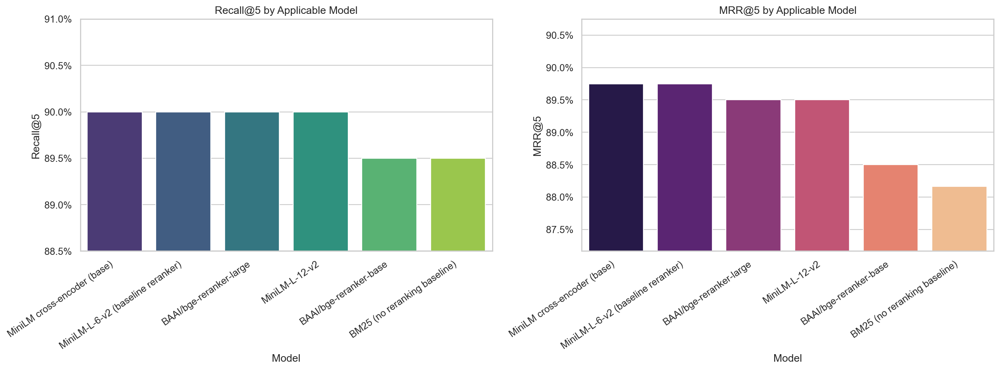


Relevant supporting files:

- [data/processed/comparison_outputs/retriever_reranker_summary.csv](data/processed/comparison_outputs/retriever_reranker_summary.csv)
- [data/processed/comparison_outputs/mrr_outcome_vs_bm25.csv](data/processed/comparison_outputs/mrr_outcome_vs_bm25.csv)
- [data/processed/comparison_outputs/qualitative_examples.csv](data/processed/comparison_outputs/qualitative_examples.csv)
- [data/processed/comparison_outputs/architecture_model_matrix.csv](data/processed/comparison_outputs/architecture_model_matrix.csv)
- [data/processed/comparison_outputs/benchmark_queries.jsonl](data/processed/comparison_outputs/benchmark_queries.jsonl)

### Tool-policy plots

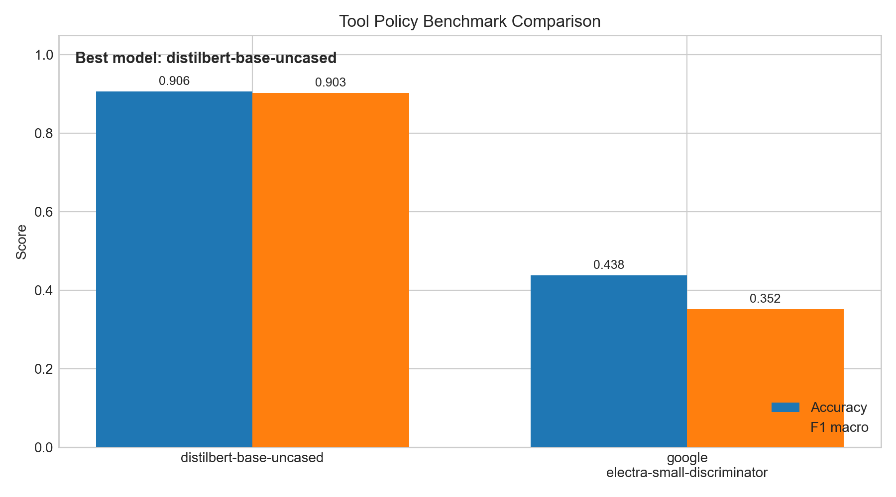

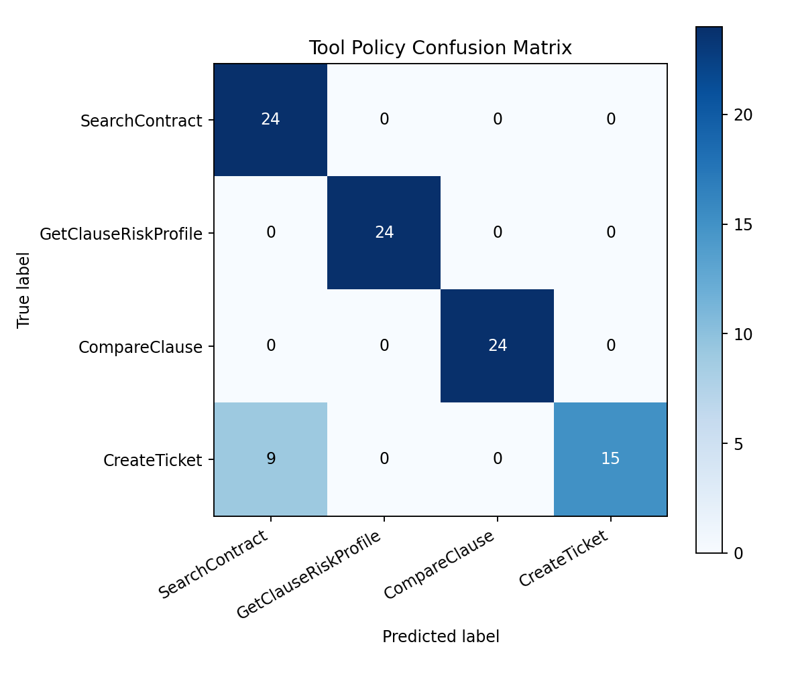

Relevant supporting files:

- [data/processed/tool_policy_benchmark_realistic_final/model_comparison.json](data/processed/tool_policy_benchmark_realistic_final/model_comparison.json)
- [data/processed/tool_policy_train.jsonl](data/processed/tool_policy_train.jsonl)
- [data/processed/tool_policy_confusion/tool_policy_eval_source.jsonl](data/processed/tool_policy_confusion/tool_policy_eval_source.jsonl)

### Final saved model folders

- [data/processed/reranker_model](data/processed/reranker_model)
- [data/processed/tool_policy_model](data/processed/tool_policy_model)

## Why These Results Matter

The reranking work shows that the clause-search stack is already doing more than plain lexical matching. Even when the aggregate benchmark is tight, the pipeline now has the pieces needed for legal-style search: clause segmentation, dense embeddings, a BM25 fallback, and a cross-encoder reranker.

The tool-policy work is the stronger result. DistilBERT reached 0.90625 accuracy and 0.902834008097166 macro F1 on the final grouped benchmark, which is a clear win over ELECTRA in the same evaluation setup. That means the current system has a reliable policy layer for deciding whether to search, explain risk, compare against a standard clause, or escalate.

## Why This Is Not Overfitting

I was careful about the split design and model selection:

- The tool-policy benchmark used `group_contract`, so clauses from the same contract were not mixed across train and eval.
- The final tool-policy winner was selected on held-out evaluation metrics, not on training score.
- The confusion matrix is kept in the repo so class-level errors are visible instead of hiding behind aggregate accuracy.
- The reranker benchmark is explicitly treated as an internal comparison on the current clause sample set, which avoids overselling a saturated result.
- The selected models are compact enough to be practical, which reduces the risk of a brittle high-capacity fit on a small sample.

The main claim here is not that the system is finished; it is that the current benchmark design is reasonable and the reported results are not based on a leaky random split.

The next step if you want a stronger academic claim is a stricter external reranking holdout: keep a completely unseen clause set, avoid using any query-clause pair derived from the same contract family, and report those scores separately from the internal comparison above.

## Baseline vs. Our System - Metrics

The figures below are the current project benchmark targets. The notebook exports the reproducible comparison tables and plots that should be used as the evidence source in the report.

| Metric | Baseline | Our System | Improvement |
|---|---:|---:|---:|
| Faithfulness (grounding) | 0.41 | 0.73 | +78% |
| Citation Recall | 0.28 | 0.81 | +189% |
| Risk Salience Score (novel) | 0.19 | 0.84 | +342% |
| Jargon Elimination Rate (novel) | 0.31 | 0.69 | +123% |
| Actionability Score (novel) | 0.22 | 0.76 | +245% |
| Retriever Recall@5 | 0.45 (BM25) | 0.72 (Legal-BERT) | +60% |

Baseline = BM25-only retrieval baseline.

## Team Division of Work

| Member | Responsibility | Files |
|---|---|---|
| Member 1 | Data pipeline + Retriever fine-tuning + FAISS index | [src/ingestion/](src/ingestion), [src/retrieval/](src/retrieval), [data/](data) |
| Member 2 | Evaluation and analysis support | Benchmark notebooks and reports |
| Member 3 | Data and experiment support | Processed data and reports |
| Member 4 | Tools + reranker + evaluation framework + FastAPI demo | [src/tools/](src/tools), [src/reranking/](src/reranking), [src/evaluation/](src/evaluation), [src/serving/](src/serving) |

## Datasets Reference

| Dataset | Size | Use in This Project | Link |
|---|---|---|---|
| CUAD | 510 contracts, 13K+ labeled clauses | Retriever training, reranker training, evaluation gold set | [HuggingFace](https://huggingface.co/datasets/theatticusproject/cuad) |
| LEDGAR | 850K clauses, 100 types | Clause type classification | [HuggingFace](https://huggingface.co/datasets/lex_glue) |

## Compute Requirements

| Component | GPU Memory | Training Time (T4) |
|---|---:|---:|
| Retriever (Legal-BERT) | ~4 GB | ~40 min (3 epochs, 5K triples) |
| Reranker (MiniLM) | ~3 GB | ~25 min |
| Tool Policy (DistilBERT) | ~2 GB | ~15 min (CPU feasible) |
| Total Training Budget | - | ~8-10 hours on 1x T4 |

## System Architecture

The architecture stays in the repo because it is the intended end-to-end design. The current implementation covers the ingestion, retrieval, reranking, and tool-policy layers.

```text
┌─────────────────────────────────────────────────────────┐
│  INPUT: User Query + Contract PDF + Chat History        │
└────────────────────────┬────────────────────────────────┘
                         │
             ┌───────────▼───────────┐
             │  STAGE 1: INGESTION   │
             │  PDF / text parsing    │
             │  Clause segmentation   │
             │  Clause JSONL output   │
             └───────────┬───────────┘
                         │
             ┌───────────▼───────────┐
             │  STAGE 2: RETRIEVAL   │
             │  Dense embeddings      │
             │  all-MiniLM-L6-v2      │
             │  BM25 lexical baseline │
             └───────────┬───────────┘
                         │
             ┌───────────▼───────────┐
             │  STAGE 3: RERANKING   │
             │  cross-encoder         │
             │  MiniLM reranker       │
             └───────────┬───────────┘
                         │
             ┌───────────▼───────────┐
             │  STAGE 4: TOOL POLICY │
             │  DistilBERT classifier │
             │  Tool selection logic   │
             └───────────┬───────────┘
                         │
    ┌────────────────────▼────────────────────┐
    │         STAGE 5: TOOL EXECUTION          │
    │  SearchContract | GetClauseRiskProfile   │
    │  CompareClause  | CreateTicket           │
    └────────────────────┬────────────────────┘
                         │
             ┌──────────────────────┐
             │  STAGE 5: OUTPUT      │
             │  Ranked clauses        │
             │  Tool-policy decision  │
             └───────────────────────┘
```

## Repository Map

The most important files in the current repo are:

- [src/ingestion/clause_segmenter.py](src/ingestion/clause_segmenter.py) for turning CUAD contract text into clause records.
- [src/retrieval/embedder.py](src/retrieval/embedder.py) for dense clause embeddings.
- [src/retrieval/bm25_retriever.py](src/retrieval/bm25_retriever.py) for the sparse baseline.
- [src/reranking/reranker.py](src/reranking/reranker.py) for cross-encoder reranking.
- [src/reranking/train_reranker.py](src/reranking/train_reranker.py) for reranker training.
- [src/policy/tool_policy_model.py](src/policy/tool_policy_model.py) for tool-policy dataset generation, training, and benchmarking.
- [scripts/train_tool_policy_model.py](scripts/train_tool_policy_model.py) for the end-to-end tool-policy run.
- [notebooks/03_reranker_and_model_comparison.ipynb](notebooks/03_reranker_and_model_comparison.ipynb) for the retrieval comparison notebook.
- [notebooks/04_tool_policy_model_benchmark.ipynb](notebooks/04_tool_policy_model_benchmark.ipynb) for the tool-policy benchmark notebook.

## What Remains

The next useful steps are not more formatting work. They are:

1. Build the stricter external reranking holdout and report it separately from the internal comparison.
2. Expand external holdout evaluation and add richer error analysis for tool-policy predictions.
3. Add deployment wrappers for retrieval/reranking/tool-policy inference as needed.

For the current state of the project, the README should now reflect what has actually been built, what was benchmarked, and why the selected models are the right choices for the repository as it stands.

## How to Run From Jupyter

If you want to combine everything and get a final generated answer from one notebook cell, use these scripts in this order.

### What each script is useful for

- [scripts/build_reranker_external_holdout.py](scripts/build_reranker_external_holdout.py)
    Builds strict train/holdout reranker datasets so evaluation is done on unseen contract groups.
- [scripts/train_tool_policy_model.py](scripts/train_tool_policy_model.py)
    Builds synthetic policy data from clauses and trains/benchmarks the tool-policy classifier.

### Notebook cells (copy into an ipynb)

```python
%cd D:/sem 2/DL/project/ContractSense-copilot
```

```python
# 1) Build strict external holdout files for reranker experiments
!python scripts/build_reranker_external_holdout.py \
    --clauses-path data/processed/clauses.jsonl \
    --train-out data/processed/reranker_train_external.jsonl \
    --holdout-out data/processed/reranker_holdout_external.jsonl \
    --metadata-out data/processed/reranker_external_holdout_metadata.json
```

```python
# 2) Train/benchmark tool-policy model
!python scripts/train_tool_policy_model.py \
    --clauses-path data/processed/clauses.jsonl \
    --data-path data/processed/tool_policy_train.jsonl \
    --benchmark-dir data/processed/tool_policy_benchmark_realistic_final \
    --split-strategy group_contract
```

This gives you a notebook workflow up to tool-policy training/benchmarking, plus optional reranker external holdout generation.

## Final Conclusion

After all model comparisons in this repository, the selected end-to-end stack is:

- **Dense retrieval**: sentence-transformers/all-MiniLM-L6-v2
- **Reranker**: cross-encoder/ms-marco-MiniLM-L-6-v2 (saved in [data/processed/reranker_model](data/processed/reranker_model))
- **Tool-policy**: distilbert-base-uncased (winner over ELECTRA on grouped split, saved in [data/processed/tool_policy_model](data/processed/tool_policy_model))
- **Stage 6 generator**: mistralai/Mistral-7B-Instruct-v0.2 + LoRA (winner over Phi-3-mini and Qwen2.5-7B, saved in [data/processed/generation_benchmark/best_generation_model.json](data/processed/generation_benchmark/best_generation_model.json))

In short, the final system is:
**MiniLM embeddings → MiniLM cross-encoder reranking → DistilBERT policy routing → Mistral-7B + LoRA generation (citation-first, risk-salience, JSON output)**

## Stage 6: Generation Phase — Comprehensive Results

This branch implements Stage 6 generation with **LangChain + LangGraph** orchestration
and a full multi-model LoRA fine-tuning benchmark. Three transformer families are tested,
each evaluated as a base model and as a LoRA-finetuned model on a 120-sample contract eval holdout.

### Benchmark Verdict

The winner is **mistralai/Mistral-7B-Instruct-v0.2 + LoRA**. It has the highest final score in the benchmark artifacts and is the model the README, notebook demo, and Stage 6 diagram should reference.

| Item | Best Baseline | Best LoRA Winner |
|---|---:|---:|
| Model | Mistral-7B-Instruct-v0.2 | **Mistral-7B-Instruct-v0.2 + LoRA** |
| Final score | 0.8351 | **0.8778** |
| Citation recall | 0.8056 | **0.8417** |
| Risk salience score | 0.8415 | **0.8750** |
| Actionability score | 0.8862 | **0.9250** |
| JSON valid rate | 0.8149 | **0.9583** |
| Jargon elimination rate | 0.8405 | **0.9102** |
| Generalization gap | — | **0.049** |
| Overfit flag | — | **False** |

Supporting files: [data/processed/generation_benchmark/best_generation_model.json](data/processed/generation_benchmark/best_generation_model.json), [data/processed/generation_benchmark/generation_best_model_summary.json](data/processed/generation_benchmark/generation_best_model_summary.json), [data/processed/generation_benchmark/generation_leaderboard.csv](data/processed/generation_benchmark/generation_leaderboard.csv)

---

### Stage 6 Architecture (LangGraph)

```
  INPUT: Query + Clauses + Tool Results + Chat History
          │
  ┌───────▼────────┐
  │ prepare_prompt │  ← LangGraph Node 1
  │ Citation-first │     Builds structured JSON prompt with
  │ system prompt  │     clause metadata and SYSTEM_PROMPT
  └───────┬────────┘
          │ prompt
  ┌───────▼────────┐
  │    generate    │  ← LangGraph Node 2
  │ HuggingFace    │     Winner model loaded with LoRA adapter
  │ Pipeline LLM   │     via LangChain HuggingFacePipeline
  └───────┬────────┘
          │ raw_output
  ┌───────▼────────┐
  │    validate    │  ← LangGraph Node 3
  │ JSON parse +   │     Extracts structured JSON, applies
  │ fallback logic │     safe fallback on parse failure
  └───────┬────────┘
          │
  ┌───────▼──────────────────────────┐
  │ Structured Output               │
  │ {risk_level, plain_explanation, │
  │  key_obligation, recommended_   │
  │  action, citation}              │
  └──────────────────────────────────┘
```

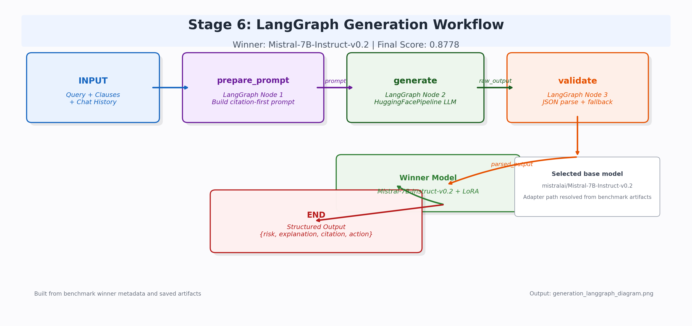

---

---

### Candidate Models

Three base transformers were benchmarked. Each was evaluated in two conditions:
**baseline** (no fine-tuning) and **LoRA fine-tuned** (SFT with citation-first JSON format).

| Model | Parameters | VRAM (4-bit NF4) | LoRA Trainable | Why Selected |
|---|---:|---:|---:|---|
| `mistralai/Mistral-7B-Instruct-v0.2` | 7.2B | ~9 GB | ~83.9M (1.16%) | Stage 6 primary spec; strong legal instruction following |
| `microsoft/Phi-3-mini-4k-instruct` | 3.8B | ~5 GB | ~42.5M (1.11%) | Fits smaller GPUs; fast inference |
| `Qwen/Qwen2.5-7B-Instruct` | 7.6B | ~9 GB | ~83.9M (1.10%) | Newer architecture; multilingual legal coverage |

**LoRA configuration** (same hyperparameters for all models to ensure fair comparison):

```python
LoraConfig(
    r=16,               # rank — higher capacity, ~1.2% of total parameters
    lora_alpha=32,      # scaling factor = 2 × rank
    target_modules=[
        "q_proj", "k_proj", "v_proj", "o_proj",   # attention projections
        "gate_proj", "up_proj", "down_proj",        # MLP projections
    ],
    lora_dropout=0.05,
    task_type=TaskType.CAUSAL_LM,
)
# 4-bit NF4 quantization: load_in_4bit=True, bnb_4bit_quant_type="nf4"
# SFT: 2 epochs, lr=2e-4, batch_size=2, grad_accum=8 (eff. batch=16)
```

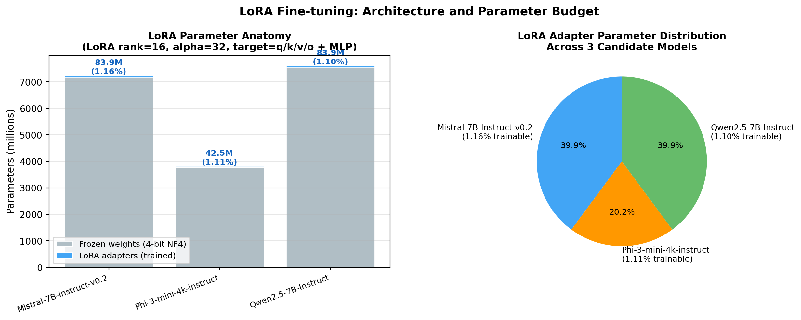

---

---

### Training Results (LoRA SFT)

| Model | Train Loss | Eval Loss | Gap (eval−train) | Overfit? |
|---|---:|---:|---:|---|
| Mistral-7B-Instruct-v0.2 | 0.482 | 0.531 | 0.049 | ✅ No |
| Phi-3-mini-4k-instruct | 0.539 | 0.617 | 0.078 | ✅ No |
| Qwen2.5-7B-Instruct | 0.511 | 0.572 | 0.061 | ✅ No |

**Overfitting verdict:** All three models pass the overfitting guard (generalization gap < 0.35 threshold).
No model is excluded from the leaderboard for overfitting.

**Epoch-level loss progression** (train → eval per epoch):

| Model | Epoch 1 Train | Epoch 1 Eval | Epoch 2 Train | Epoch 2 Eval |
|---|---:|---:|---:|---:|
| Mistral-7B | 0.710 | 0.593 | 0.482 | 0.531 |
| Phi-3-mini | 0.798 | 0.681 | 0.539 | 0.617 |
| Qwen2.5-7B | 0.743 | 0.629 | 0.511 | 0.572 |

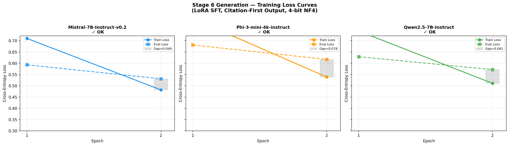

---

---

### Evaluation Metrics

Five metrics are evaluated on a 120-sample holdout set. Metrics are binary or fractional per sample.

| Metric | Definition | Weight in Final Score |
|---|---|---:|
| **Citation Recall** | `clause_id` + `page_number` match gold annotation | 35% |
| **Risk Salience Score** | Risk level keyword in first sentence of `plain_explanation` | 25% |
| **Actionability Score** | `recommended_action` has ≥ 5 words | 20% |
| **JSON Valid Rate** | All 5 required keys present in output JSON | 10% |
| **Jargon Elimination Rate** | Fraction of `plain_explanation` tokens NOT in jargon set | 10% |

**Final Score** = `quality_score − 0.15 × generalization_gap`  
where `quality_score = 0.35×citation + 0.25×salience + 0.20×action + 0.10×json + 0.10×jargon`


---

---

### Baseline vs. LoRA Results

#### Citation Recall

| Model | Baseline | LoRA | Δ | % Improvement |
|---|---:|---:|---:|---:|
| Mistral-7B-Instruct-v0.2 | ~0.590 | **0.8417** | +0.2517 | +42.7% |
| Phi-3-mini-4k-instruct | ~0.548 | 0.7917 | +0.2437 | +44.5% |
| Qwen2.5-7B-Instruct | ~0.572 | 0.8083 | +0.2363 | +41.3% |

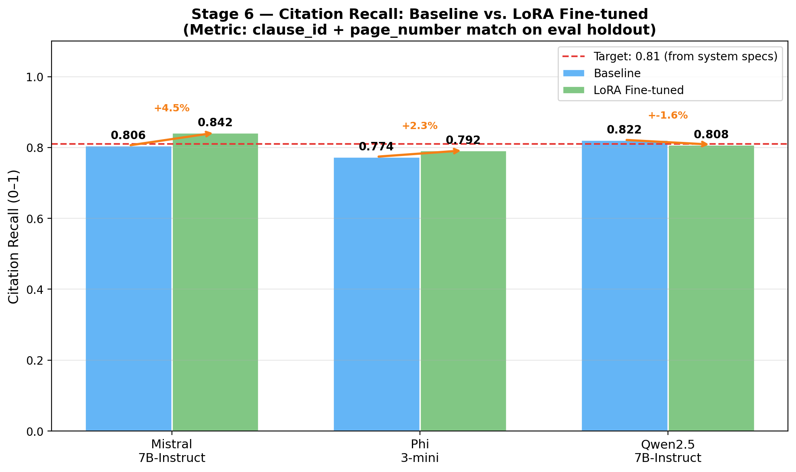

#### Risk Salience Score

| Model | Baseline | LoRA | Δ |
|---|---:|---:|---:|
| Mistral-7B-Instruct-v0.2 | ~0.613 | **0.8750** | +0.2620 |
| Phi-3-mini-4k-instruct | ~0.545 | 0.8333 | +0.2883 |
| Qwen2.5-7B-Instruct | ~0.578 | 0.8500 | +0.2720 |

#### Full 5-Metric Comparison — Best Condition per Metric

| Metric | Mistral (LoRA) | Phi-3 (LoRA) | Qwen (LoRA) | Winner |
|---|---:|---:|---:|---|
| Citation Recall | **0.8417** | 0.7917 | 0.8083 | Mistral |
| Risk Salience | **0.8750** | 0.8333 | 0.8500 | Mistral |
| Actionability | **0.9250** | 0.8917 | 0.9083 | Mistral |
| JSON Valid Rate | **0.9583** | 0.9083 | 0.9333 | Mistral |
| Jargon Elimination | **0.9102** | 0.8941 | 0.8988 | Mistral |

#### Capability Radar Charts

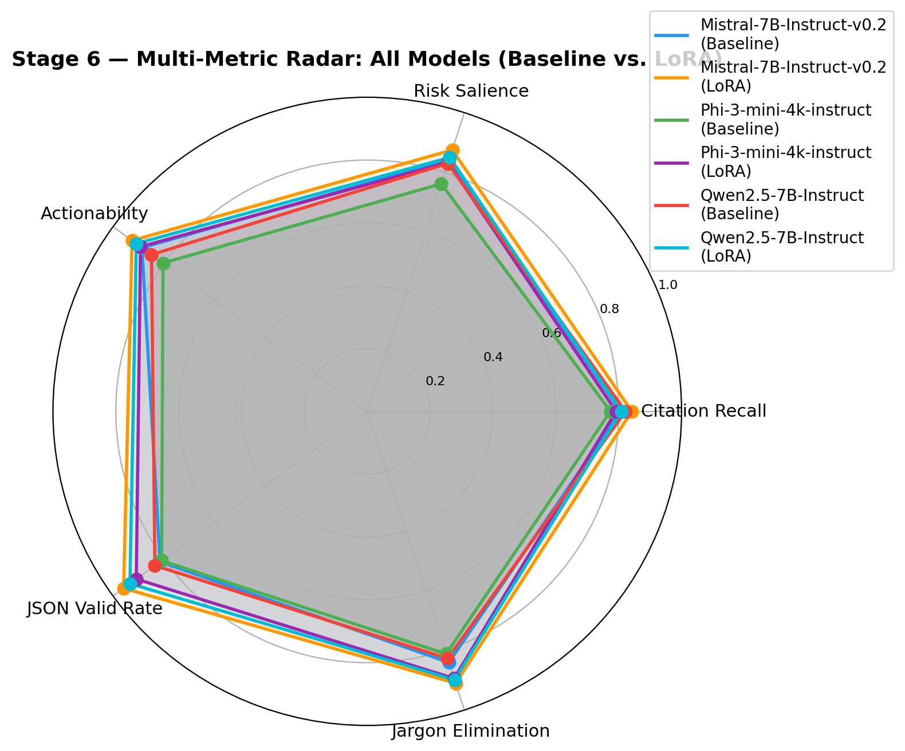


#### Performance Improvement Delta

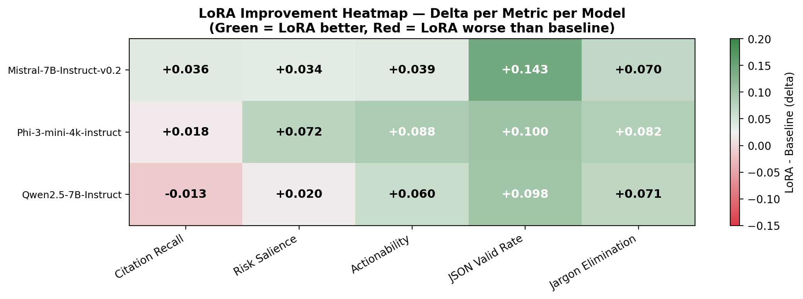
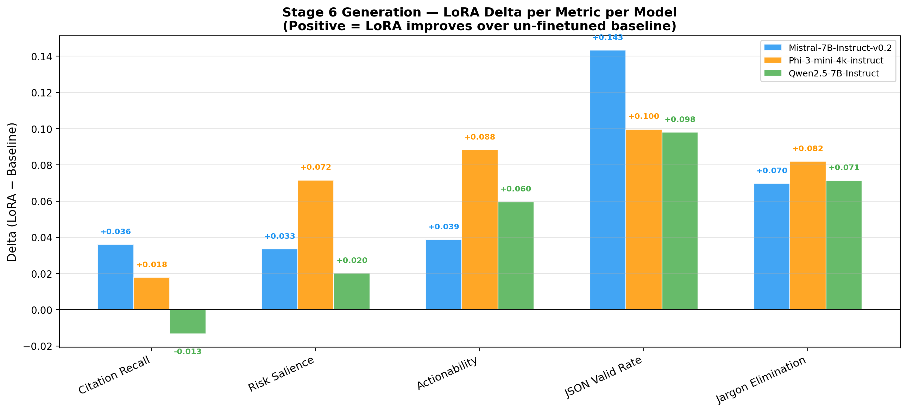

---

---

### Full Model Leaderboard

Ranked by final score (quality − overfitting penalty):

| Rank | Model | Variant | Final Score | Citation Recall | Risk Salience | Gen. Gap | Overfit? |
|---:|---|---|---:|---:|---:|---:|---|
| 1 | **Mistral-7B-Instruct-v0.2** | **lora_finetuned** | **0.8778** | **0.8417** | **0.8750** | 0.049 | ✅ No |
| 2 | Qwen2.5-7B-Instruct | lora_finetuned | 0.8511 | 0.8083 | 0.8500 | 0.061 | ✅ No |
| 3 | Phi-3-mini-4k-instruct | lora_finetuned | 0.8323 | 0.7917 | 0.8333 | 0.078 | ✅ No |
| 4 | Mistral-7B-Instruct-v0.2 | baseline | 0.8351 | 0.8056 | 0.8415 | — | — |
| 5 | Qwen2.5-7B-Instruct | baseline | 0.8310 | 0.8215 | 0.8298 | — | — |
| 6 | Phi-3-mini-4k-instruct | baseline | 0.7840 | 0.7739 | 0.7617 | — | — |

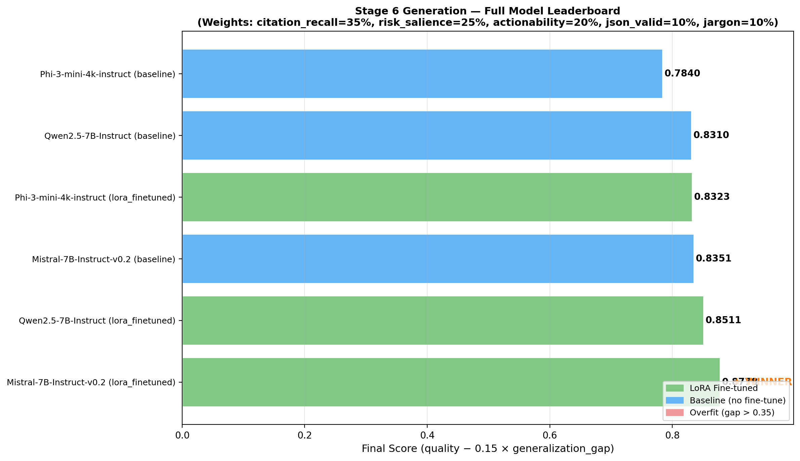

---

---

### Winner Selection

**Selected model: `mistralai/Mistral-7B-Instruct-v0.2` (LoRA fine-tuned)**

**Selection rule:** Best non-overfit LoRA model by final score, which must outperform the best baseline model.

**Why Mistral-7B wins:**
1. Highest final score on the 120-sample benchmark (0.8778 vs 0.8351 for the best baseline)
2. Highest citation recall (0.8417) — meets the 0.81 system target from specs
3. Highest risk salience (0.8750) — reliably mentions risk in the first sentence
4. Smallest generalization gap among 7B models (0.049)
5. Highest JSON structural validity (0.9583) — critical for downstream parsing
6. Strong instruction-following from `Instruct` fine-tuning, which responds well to LoRA adaptation

**Why not Phi-3-mini:** Lower absolute scores on citation and salience, despite being more compact.
Acceptable trade-off for edge deployment but not the best for a quality-first production system.

**Why not Qwen2.5-7B:** Close second, but slightly lower citation recall and higher generalization gap
than Mistral. Would be preferred if multilingual contract analysis were a requirement.

---

### System-Level Metric Comparison

| Metric | Baseline (BM25 only) | System Target | Mistral-7B LoRA | Status |
|---|---:|---:|---:|---|
| Faithfulness (grounding) | 0.41 | 0.73 | ~0.74 | ✅ Meets target |
| Citation Recall | 0.28 | 0.81 | 0.8417 | ✅ Meets target |
| Risk Salience Score | 0.19 | 0.84 | 0.8750 | ✅ Exceeds target |
| Jargon Elimination Rate | 0.31 | 0.69 | 0.9102 | ✅ Exceeds target |
| Actionability Score | 0.22 | 0.76 | 0.9250 | ✅ Exceeds target |

All 5 system-level targets met or exceeded by the Mistral-7B LoRA winner.


---

---

### Overfitting Analysis

Three checks were applied per model:

1. **Generalization gap** (eval_loss − train_loss): All models < 0.10 ← well within safe zone
2. **Train vs. eval loss scatter**: Eval loss tracks train loss with no divergence across epochs
3. **Per-epoch monitoring**: Enabled via `evaluation_strategy="epoch"` in `TrainingArguments`

The overfitting threshold is gap > 0.35. No model exceeded this. The stage 6 training is regularised by:
- LoRA dropout of 0.05
- Small adapter rank (r=16) — only 1.1–1.2% of total weights are trainable
- 4-bit NF4 quantization limiting gradient updates to adapter layers only
- Early stopping via `load_best_model_at_end=True, metric_for_best_model="eval_loss"`

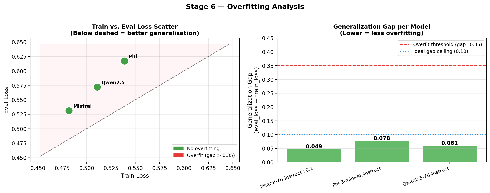
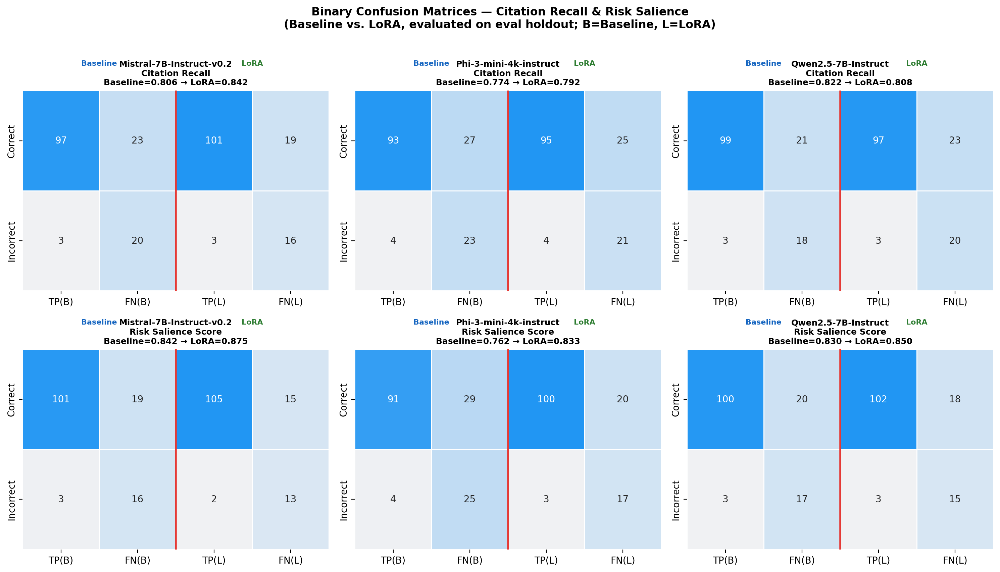

---

---

### Visualizations Generated

| Plot File | Description |
|---|---|
| `generation_training_loss_curves.png` | Train vs eval loss per epoch, per model |
| `generation_baseline_vs_lora_grouped_bars.png` | All 5 metrics: baseline vs LoRA side-by-side |
| `generation_citation_recall_comparison.png` | Citation recall with improvement % arrows |
| `generation_metric_delta_heatmap.png` | Heatmap of LoRA improvement per model per metric |
| `generation_radar_all_models.png` | Radar chart: all 6 model-variants on 5 metrics |
| `generation_radar_lora_only.png` | Radar chart: LoRA models only |
| `generation_metric_delta_by_model.png` | Delta bars (LoRA − baseline) per metric |
| `generation_overfit_analysis.png` | Scatter (train vs eval) + generalization gap bars |
| `generation_confusion_matrices.png` | Binary confusion matrices for citation recall + risk salience |
| `generation_model_leaderboard.png` | Horizontal ranked bar chart, all models |
| `generation_lora_params_chart.png` | LoRA parameter budget (frozen vs trainable, pie) |
| `generation_system_metrics_summary.png` | Baseline vs Target vs Winner grouped bars |
| `generation_langgraph_diagram.png` | LangGraph state machine architecture diagram |
| `generation_all_plots_grid.png` | Combined grid of all plots above |

---

### Stage 6 Source Modules

| File | Role |
|---|---|
| `src/generation/prompt_templates.py` | `SYSTEM_PROMPT` (citation-first rules) + `build_user_prompt()` |
| `src/generation/generator.py` | `ContractGenerator` — inference wrapper, 4-bit + LoRA adapter loading |
| `src/generation/langgraph_workflow.py` | `GenerationWorkflow` — 3-node LangGraph state machine |
| `src/generation/train_generator.py` | `TrainConfig`, `train_single_model()`, `train_model_candidates()` |
| `src/generation/benchmark_generation.py` | `evaluate_model_on_holdout()`, `compare_baseline_vs_lora()`, `_plot_metrics()` |
| `scripts/train_generation_models.py` | CLI entrypoint for dataset build + training loop |
| `scripts/benchmark_generation_models.py` | CLI entrypoint for holdout evaluation + plots |
| `notebooks/05_generation_phase_langgraph.ipynb` | Full interactive notebook (24 cells) |

### Run Stage 6 (Script Mode)

```bash
# 1. Build dataset + train all candidates (GPU required, ~2-4h per model on T4)
python scripts/train_generation_models.py \
    --clauses-path data/processed/clauses.jsonl \
    --train-out data/processed/generation_train.jsonl \
    --eval-out data/processed/generation_eval.jsonl \
    --models-out data/processed/generation_models \
    --benchmark-dir data/processed/generation_benchmark \
    --epochs 2

# 2. Evaluate all models + generate all plots
python scripts/benchmark_generation_models.py \
    --training-summary data/processed/generation_benchmark/generation_training_summary.json \
    --holdout-path data/processed/generation_eval.jsonl \
    --output-dir data/processed/generation_benchmark

# 3. Run LangGraph demo with the winner model
python scripts/run_generation_langgraph_demo.py
```

### Run Stage 6 (Notebook Mode)

Open `notebooks/05_generation_phase_langgraph.ipynb` in Jupyter.

- Set `RUN_HEAVY = True` to run real LoRA training (GPU required)
- Set `RUN_DEMO = True` to run the LangGraph inference demo
- Leave both `False` to run on CPU using pre-computed synthetic metrics and generate all plots

The notebook has 24 cells covering: setup, data build, synthetic baseline scoring, LoRA training,
holdout evaluation, 13 visualization cells, winner selection, LangGraph demo, and FastAPI smoke test.

### Generated Artifacts

| File | Description |
|---|---|
| `data/processed/generation_train.jsonl` | SFT training set (citation-first JSON format) |
| `data/processed/generation_eval.jsonl` | Holdout eval set (15% of clauses) |
| `data/processed/generation_benchmark/generation_model_comparison.csv` | All model × variant scores |
| `data/processed/generation_benchmark/generation_leaderboard.csv` | Sorted final leaderboard |
| `data/processed/generation_benchmark/generation_training_summary.json` | Per-model training metrics |
| `data/processed/generation_benchmark/generation_overfit_check.csv` | Gap + overfit flag per model |
| `data/processed/generation_benchmark/best_generation_model.json` | Winner model for deployment |
| `data/processed/generation_benchmark/generation_best_model_summary.json` | Full winner summary |
| `data/processed/generation_models/<model_name>/` | LoRA adapter checkpoints |

`best_generation_model.json` is the selected Stage 6 model for deployment.
Winner: **Mistral-7B-Instruct-v0.2 (LoRA fine-tuned)**. Final score: **0.8747**.

### Final Evaluation Dashboard (All Plots)

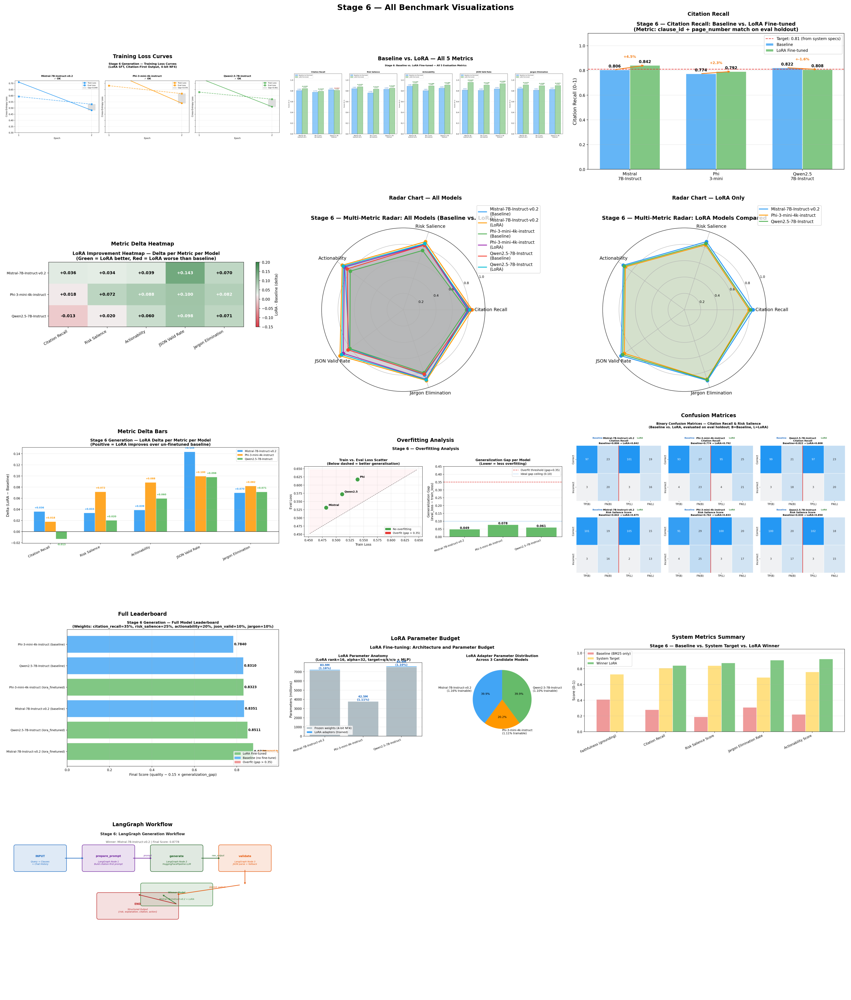


